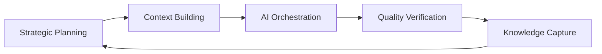

# 🧠 Workflow Philosophy

**The mindset shift from AI user to AI collaboration architect** - Transform how you think about development.

## The Philosophy Evolution

> *"Workflow to nie plik, to jak pracujesz z AI"*

### Level 1: AI as Tool
❌ **Beginner Mindset:**
- Ask AI to write code
- Copy-paste without understanding  
- Single, isolated interactions
- Manual, repetitive prompting

### Level 2: AI as Assistant  
🔄 **Intermediate Mindset:**
- AI helps with specific tasks
- Some workflow patterns emerge
- Basic context management
- Occasional strategic thinking

### Level 3: AI as Collaboration Partner
✅ **Advanced Mindset:**
- AI extends your thinking capacity
- Systematic workflow orchestration
- Strategic long-term planning
- Automated expertise capture

## Core Philosophy Principles

### 1. Amplified Intelligence, Not Replaced Intelligence

**Your Role Evolution:**
```
Traditional Developer → AI-Amplified Architect

From: Writing every line of code
To: Designing systems and orchestrating AI implementation

From: Solving problems alone  
To: Leading AI teams to solve complex challenges

From: Manual repetitive work
To: Strategic thinking and quality orchestration
```

### 2. Context as Competitive Advantage

**Context = Power:**
- **Rich Context** → Higher quality AI output
- **Preserved Context** → Continuity across sessions
- **Structured Context** → Scalable team workflows
- **Strategic Context** → Business-aligned development

**Context Investment Strategy:**
```
Time spent building context = 10x returns in AI productivity
- CLAUDE.md files: 30 minutes → Months of consistent AI behavior
- Pattern documentation: 1 hour → Zero ramp-up time for new features  
- Workflow automation: 2 hours → 50% faster development cycles
```

### 3. Workflow as System Architecture

**Traditional View:** Workflow = checklist to follow
**Advanced View:** Workflow = system that executes itself

```
Level 1: Manual checklist
- [ ] Research existing patterns
- [ ] Plan implementation  
- [ ] Code feature
- [ ] Write tests
- [ ] Deploy

Level 2: Automated workflow  
/research-first → /plan-feature → /implement → /test → /deploy

Level 3: Orchestrated system
PM Agent → FE Agent → BE Agent → QA Agent → Integration → Deploy
```

### 4. Thinking Modes as Cognitive Architecture

**Match computational investment to problem complexity:**

```
Simple tasks (CRUD, bug fixes):
- Default mode: Fast execution
- Pattern: "Follow existing pattern for X"

Complex tasks (new features):  
- think hard: Consider edge cases and integration
- Pattern: "Research → Plan → Implement → Verify"

Critical decisions (architecture, security):
- ultrathink: Deep analysis of long-term implications  
- Pattern: "Analyze all options → Consider trade-offs → Document decision"

System design (platform choices):
- ultrathink: Business, technical, and strategic analysis
- Pattern: "Current state → Future needs → Migration strategy → Risk assessment"
```

## Advanced Workflow Patterns

### The AI Development Cycle



**1. Strategic Planning**
- Business objectives alignment
- Technical architecture decisions  
- Resource allocation and timeline
- Success metrics definition

**2. Context Building**  
- CLAUDE.md ecosystem creation
- Pattern documentation
- Historical decision capture
- Team knowledge sharing

**3. AI Orchestration**
- Multi-agent task distribution
- Workflow automation implementation
- Custom command deployment
- Integration coordination

**4. Quality Verification**
- Automated quality gates
- Security and performance review
- Business requirement validation
- User experience verification

**5. Knowledge Capture**
- Pattern extraction and documentation
- Workflow optimization learnings
- Team expertise codification
- Continuous improvement integration

### The Expertise Multiplication Effect

**Traditional Development:**
```
1 Developer × 1 Skill Set = 1 Unit of Output
```

**AI-Amplified Development:**  
```
1 Developer × AI × Orchestrated Workflows × Captured Expertise = 10x Output
```

**Expertise Layers:**
1. **Personal Expertise**: Your skills and experience
2. **AI Capabilities**: Claude's knowledge and reasoning
3. **Workflow Systems**: Automated best practices
4. **Captured Knowledge**: Team and industry wisdom
5. **Network Effects**: Multiple AI agents working together

### The Compound Learning Advantage

**Traditional Learning Curve:**
- Individual skill development
- Manual pattern recognition
- Experience-based improvement
- Linear growth trajectory

**AI-Amplified Learning Curve:**
- AI-assisted pattern discovery
- Automated expertise capture
- Systematic workflow optimization  
- Exponential capability growth

```
Months 1-3: Building AI workflow foundations
Months 4-6: Expertise multiplication begins
Months 7-12: Compound advantages accelerate
Year 2+: AI collaboration mastery achieved
```

## Psychological Shifts

### From Control to Orchestration

**Old Mindset:** "I must understand and write every line of code"
**New Mindset:** "I design systems and orchestrate AI implementation"

**Practical Changes:**
- Focus on architecture over implementation details
- Emphasize quality gates over manual review
- Value consistency over individual code style
- Prioritize business outcomes over technical perfection

### From Individual to Collective Intelligence

**Old Mindset:** "My brain + my experience = my output"  
**New Mindset:** "My strategy + AI capabilities + captured expertise = amplified output"

**Practical Changes:**
- Invest in context building over immediate coding
- Document patterns for AI reuse
- Build workflows that encode expertise
- Think in terms of AI team coordination

### From Project to Platform Thinking

**Old Mindset:** "Build this feature for this project"
**New Mindset:** "Build capabilities and patterns that accelerate all future work"

**Practical Changes:**
- Create reusable AI command libraries
- Build context systems that scale across projects
- Develop workflow patterns that team can adopt
- Focus on platform capabilities over individual solutions

## Implementation Psychology

### The 40-Hour Rule

**Week 1-2:** Foundation Building
- Set up claude-prompts repository
- Create basic CLAUDE.md files
- Establish core workflow patterns
- Begin habit formation

**Week 3-4:** Pattern Recognition
- Identify most valuable AI interactions
- Document successful prompt patterns
- Automate repetitive workflows
- Refine thinking mode usage

**Week 5-6:** System Integration
- Implement multi-agent workflows
- Create custom commands for frequent tasks
- Build context management systems
- Optimize for team collaboration

**Week 7-8:** Mastery Acceleration
- Advanced orchestration patterns
- Expertise capture automation
- Strategic business integration
- Compound productivity gains

### Habit Architecture

**Daily Practices:**
- `pre-code`: Context review before starting work
- Strategic AI conversations during development breaks
- `post-code`: Quality verification and knowledge capture
- Pattern documentation at end of significant work

**Weekly Practices:**
- Workflow optimization review
- Command effectiveness analysis
- Context system refinement
- Team pattern sharing

**Monthly Practices:**
- Strategic capability assessment
- AI workflow architecture review
- Expertise multiplication evaluation
- Long-term platform planning

## Business Philosophy Integration

### AI as Business Multiplier

**Strategic Advantages:**
- **Speed**: 3-10x faster development cycles
- **Quality**: AI-enforced best practices and consistency
- **Scalability**: Workflow patterns that work for teams
- **Innovation**: More time for strategic thinking and business development

**Competitive Differentiation:**
- While competitors use AI as advanced autocomplete
- You use AI as strategic development partner
- Your expertise compounds through AI amplification
- Your workflows become competitive moats

### Value Creation Framework

**Traditional Value Creation:**
```
Time × Skill = Output × Business Value
```

**AI-Amplified Value Creation:**
```
Strategic Thinking × AI Orchestration × Captured Expertise × Automated Workflows = 10x Business Value
```

**Investment Strategy:**
- Short-term: Build AI workflow foundations
- Medium-term: Develop team AI capabilities
- Long-term: Create AI-native competitive advantages

## The Meta-Philosophy

### Continuous Evolution Mindset

**AI Capabilities Evolve:**
- New Claude features and improvements
- Enhanced reasoning and capabilities
- Better integration possibilities
- More sophisticated workflow opportunities

**Your Response Strategy:**
- Maintain learning and adaptation mindset
- Regularly update workflows and patterns
- Experiment with new AI collaboration approaches
- Share and learn from AI workflow community

### Future-Proofing Philosophy

**Principles That Endure:**
1. **Context and patterns over specific implementations**
2. **Workflow systems over individual productivity hacks**
3. **Strategic thinking over tactical execution**
4. **Business value creation over technical optimization**

**Adaptability Framework:**
- Core philosophy remains constant
- Tactical implementations evolve with AI capabilities
- Strategic advantages compound over time
- Competitive moats deepen through expertise capture

## Success Metrics

### Personal Productivity
- **10x Development Speed**: Complex features in days not weeks
- **Quality Consistency**: AI-enforced best practices
- **Strategic Time**: More time for architecture and business thinking
- **Learning Acceleration**: Rapid expertise acquisition and application

### Business Impact  
- **Competitive Advantage**: AI-native development capabilities
- **Team Scaling**: Workflow patterns enable rapid team growth
- **Innovation Capacity**: AI handles implementation, you focus on strategy
- **Market Responsiveness**: Faster iteration and deployment cycles

### Long-term Value
- **Expertise Compounding**: Knowledge systems that appreciate over time
- **Platform Effects**: AI workflows become foundation for all future work
- **Network Value**: Team AI capabilities create network effects
- **Strategic Positioning**: AI collaboration mastery as core competency

*The future belongs to those who master AI collaboration, not just AI usage.* 🚀